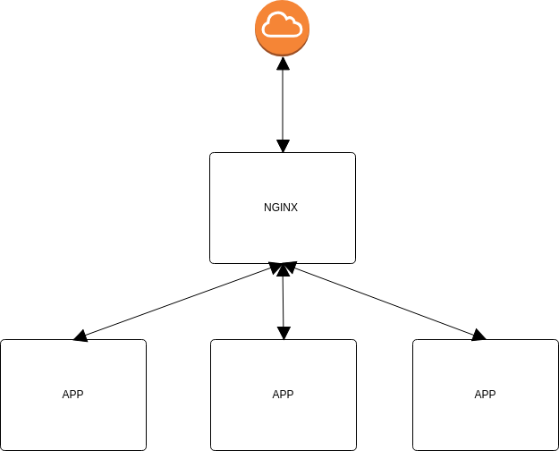
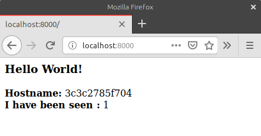

## Docker - Scale example

A little toy example of a nginx in front of a scalable service.



You only need to execute:

```docker-compose up```

And visit your browser [localhost:8000](localhost:8000). Each visit iterates on the 3 instances of the application. You can see the number of visits you have made to each one and the host name that responds.

Examples:


